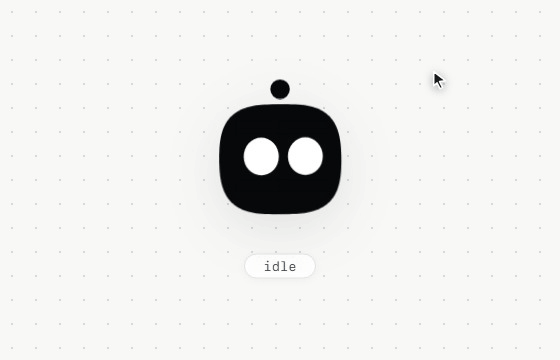
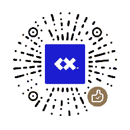

# Agent Robot Avatar

[English](./README.md) | [简体中文](./docs/README.zh-CN.md) | [繁體中文](./docs/README.zh-TW.md) | [日本語](./docs/README.ja.md) | [한국어](./docs/README.ko.md) | [Español](./docs/README.es.md) | [Português](./docs/README.pt.md) | [Deutsch](./docs/README.de.md) | [Français](./docs/README.fr.md)

 [](./LICENSE) [](https://github.com/CX-ArtLab/agent-robot-avatar/actions/workflows/validate.yml) [](https://ko-fi.com/P0E625WIOI)

      

A lightweight, expressive robot avatar Web Component for AI agents and other interactive applications.

Agent Robot Avatar is built with SVG and vanilla JavaScript. It has no third-party animation framework dependency, works as a native custom element, and exposes a compact API for expressions, interaction states, pointer behavior, waiting feedback, and head-shape customization.

**Current public version: v0.1.0**

<p align="center">
  
</p>

## Highlights

- Pure SVG + vanilla JavaScript
- Native Web Component
- No third-party animation framework
- Automatic blinking and subtle idle gaze
- Pointer-following eyes and inertial head movement
- Jelly-style local drag deformation with elastic recovery
- Programmatically controlled Agent states and expressions
- Distinct waiting, failure, warning, review, blocked-content, and system-error semantics
- Adjustable head roundness
- Floating antenna with optional status flashing
- Demo UI kept separate from the reusable component

## Quick start

When using the repository source directly, keep `agent-robot-avatar.js` together with the `src/` directory, then load the public entry:

```html
<script type="module" src="./agent-robot-avatar.js"></script>
```

Add the custom element:

```html
<agent-robot-avatar id="avatar"></agent-robot-avatar>
```

The avatar enters its default idle behavior automatically. No initialization code is required.

A minimal runnable example is available at [`examples/basic.html`](./examples/basic.html).

## Basic API

Trigger an expression or state with `play()`:

```js
const avatar = document.querySelector('#avatar');

avatar.play('success');
avatar.play('failure');
avatar.play('warning');
avatar.play('inspect');
avatar.play('angry');
avatar.play('error');
```

Return to the default idle state:

```js
avatar.reset();
```

## Actions and states

| State | API name | Intended use |
| --- | --- | --- |
| Idle | `idle` | Default idle state |
| Bored | `bored` | Long idle periods or no active task |
| Waiting | `waiting` | A request has been sent and a result is still pending |
| Input | `input` | The user is typing |
| Send | `send` | Content was sent / nod feedback |
| Success | `success` | A task completed successfully |
| Failure | `failure` | A task completed unsuccessfully |
| Warning | `warning` | A risky or destructive action needs confirmation |
| Inspect | `inspect` | Reviewing, checking, or verifying a result |
| Blocked | `angry` | A request is blocked, disallowed, or cannot proceed |
| System error | `error` | Connection, service, or system failure |
| Surprise | `surprise` | An unexpected event or result |
| Sleep | `sleep` | Enter the sleep state |
| Wake | `wake` | Wake from sleep |

The state names intentionally distinguish task results from system conditions. For example, `failure` means the requested task finished unsuccessfully, while `error` is reserved for connection, service, or system failures. `waiting` represents an active pending request; `bored` represents inactivity.

Semantic aliases are also available:

```js
avatar.play('failed');           // same as failure
avatar.play('fail');             // same as failure
avatar.play('verify');           // same as inspect
avatar.play('review');           // same as inspect
avatar.play('blocked');          // same as angry
avatar.play('policy-blocked');   // same as angry
avatar.play('system-error');     // same as error
avatar.play('connection-error'); // same as error
```

## Continuous waiting

For real Agent workflows, use the dedicated waiting lifecycle when a request is in progress:

```js
avatar.startWaiting();

// Stop when a response or result arrives.
avatar.stopWaiting();
```

Calling another action also interrupts the active waiting state.

## Pointer following

Pointer following is enabled by default and can be controlled programmatically:

```js
avatar.setPointerFollow(false);
avatar.setPointerFollow(true);
```

## Head roundness

The head shape can be adjusted from a squarer form to a rounder form without changing the eye clipping or drag-deformation system:

```js
avatar.setHeadRoundness(0);   // squarer
avatar.setHeadRoundness(50);  // default
avatar.setHeadRoundness(100); // rounder

console.log(avatar.getHeadRoundness());
```

Values are clamped to the `0–100` range. The interactive Demo uses three presets by default and can unlock continuous adjustment.

The component emits `head-roundness-change` when the value changes:

```js
avatar.addEventListener('head-roundness-change', (event) => {
  console.log(event.detail.value);
});
```

## State event

The component emits a `face-state` event whenever its visual state changes:

```js
avatar.addEventListener('face-state', (event) => {
  console.log(event.detail.state);
});
```

Host applications can use this event to synchronize interface state, logs, Agent workflows, or accessibility feedback.

## Attributes

```html
<agent-robot-avatar
  size="160"
  color="#08090b"
  auto-sleep="30000">
</agent-robot-avatar>
```

| Attribute | Description |
| --- | --- |
| `size` | Component size in pixels |
| `color` | Main avatar color |
| `auto-sleep` | Idle time before automatic sleep, in milliseconds; `0` disables automatic sleep |

All attributes are optional.

## Default behavior

Without explicit API calls, the avatar already provides subtle ambient behavior:

- Random blinking
- Subtle gaze wandering
- Pointer following when the cursor is nearby
- Light inertial head movement
- Natural return to idle
- Optional automatic sleep

## Drag interaction

The avatar supports direct pointer dragging. The head deforms locally around the interaction point instead of moving as a rigid object.

- Strong outward pull: triggers `angry` after recovery
- Strong inward push toward the center: triggers `success` after recovery
- Small drag: deformation only, with no expression trigger

When released, the shape returns with an elastic rebound.

## Interactive Demo

`demo/index.html` contains the full interactive Demo, including:

- All public expression states
- Pointer following
- Jelly drag deformation
- Waiting lifecycle
- Head-roundness presets and continuous adjustment
- Color and behavior controls
- Simulated Agent conversation states

The interactive Demo and Demo-only JavaScript are isolated in `demo/` and are not included in the reusable package runtime.

## Project structure

```text
agent-robot-avatar.js     Public component entry
src/                      Reusable component runtime and expression modules
demo/                     Interactive Demo and Demo-only helpers
examples/                 Minimal integration examples
assets/support/           Support / payment QR assets
docs/                     Localized documentation
README.md                 English main documentation
CHANGELOG.md              Public release history
CONTRIBUTING.md           Contribution guide
package.json              Package metadata
LICENSE                   MIT License
```

## Distribution

The repository contains npm-compatible package metadata, but the npm package is not published yet. The source repository is the canonical distribution for v0.1.0 until package publication is announced.

The npm package intentionally includes only the public entry, `src/` runtime, documentation, and support assets; Demo-only files are excluded.

## Compatibility

Agent Robot Avatar is designed for modern browsers with support for ES modules, Custom Elements, SVG, Pointer Events, and the Web Animations API.

## Contributing

Issues and pull requests are welcome. See [`CONTRIBUTING.md`](./CONTRIBUTING.md) before submitting changes.

## Project status

v0.1.0 is the first public release line. The public API is intentionally small so it can evolve carefully before a future `1.0.0` stability commitment.

Agent Robot Avatar is independently developed and is not affiliated with, endorsed by, or representative of any AI platform or brand.

## License

MIT License. See [`LICENSE`](./LICENSE).

## Buy me a coffee

If this project is useful to you, you can buy me a coffee. Use whichever option is most convenient:

| Ko-fi | Alipay | WeChat Pay |
| --- | --- | --- |
| <a href='https://ko-fi.com/P0E625WIOI' target='_blank'></a> |  |  |
