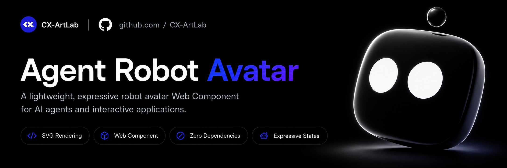

# Agent Robot Avatar

<p align="center">
  
</p>

[English](https://github.com/CX-ArtLab/agent-robot-avatar/blob/main/README.md) | [简体中文](https://github.com/CX-ArtLab/agent-robot-avatar/blob/main/docs/README.zh-CN.md) | [繁體中文](https://github.com/CX-ArtLab/agent-robot-avatar/blob/main/docs/README.zh-TW.md) | [日本語](https://github.com/CX-ArtLab/agent-robot-avatar/blob/main/docs/README.ja.md) | [한국어](https://github.com/CX-ArtLab/agent-robot-avatar/blob/main/docs/README.ko.md) | [Español](https://github.com/CX-ArtLab/agent-robot-avatar/blob/main/docs/README.es.md) | [Português](https://github.com/CX-ArtLab/agent-robot-avatar/blob/main/docs/README.pt.md) | [Deutsch](https://github.com/CX-ArtLab/agent-robot-avatar/blob/main/docs/README.de.md) | [Français](https://github.com/CX-ArtLab/agent-robot-avatar/blob/main/docs/README.fr.md)

 [](../LICENSE) [](https://github.com/CX-ArtLab/agent-robot-avatar/actions/workflows/validate.yml) [](https://ko-fi.com/P0E625WIOI)

      

一个轻量、富有表现力的机器人头像 Web Component，可用于 AI Agent，也可用于其他需要交互反馈的应用。

适用于 AI 助手和 Agent 交互界面，包括与 ChatGPT、Claude、Codex、Cursor、Grok Bot、Gemini CLI 和 OpenCode 类似的产品与使用场景。

它也可用于桌面宠物、虚拟宠物、桌面伙伴、数字吉祥物、聊天机器人头像以及其他互动角色体验。

Agent Robot Avatar 也可作为 AG-UI 类 Agent 界面的视觉反馈层。

Agent Robot Avatar 基于 SVG 与原生 JavaScript 构建，不依赖第三方动画框架。它作为原生自定义元素工作，并提供一组尽量精简的 API，用于控制表情、交互状态、鼠标跟随、等待反馈和头部造型。

**当前公开版本：v0.2.0**

<p align="center">
  
</p>

## 在线演示

直接体验交互效果：[打开 Agent Robot Avatar 在线演示](https://cx-artlab.github.io/agent-robot-avatar/?lang=zh-CN)

## 主要特点

- 纯 SVG + 原生 JavaScript
- 原生 Web Component
- 无第三方动画框架依赖
- 自动眨眼与轻微随机视线活动
- 鼠标 / 指针跟随与带惯性的头部运动
- 局部果冻式拖拽形变与弹性回弹
- 可由程序主动触发的 Agent 状态与表情
- 明确区分等待、失败、警告、审视、内容阻止与系统错误
- 可调整头部圆角
- 悬浮式天线，并支持可选状态闪动
- Demo 界面与可复用组件本体分离

## 快速开始

直接使用仓库源码时，请保持根目录的 `agent-robot-avatar.js` 与 `src/` 目录一起使用，然后加载公开入口：

```html
<script type="module" src="./agent-robot-avatar.js"></script>
```

在页面中加入：

```html
<agent-robot-avatar id="avatar"></agent-robot-avatar>
```

组件加载后会自动进入默认待机状态，不需要额外初始化。

最小可运行示例位于 [`examples/basic.html`](../examples/basic.html)。

使用打包工具的项目可以通过 npm 安装和引入：

```bash
npm install agent-robot-avatar
```

```js
import 'agent-robot-avatar';
```

npm 包内置 TypeScript 类型声明，覆盖动作名称、事件和公开方法，无需另外安装类型包。

## 基本 API

统一通过 `play()` 触发表情或状态：

```js
const avatar = document.querySelector('#avatar');

avatar.play('success');
avatar.play('failure');
avatar.play('warning');
avatar.play('inspect');
avatar.play('blocked');
avatar.play('error');
```

恢复默认待机：

```js
avatar.reset();
```

`reset()` 会取消待完成的动画并恢复待机。移除元素也会取消计时器、动画、等待和拖拽反馈，清理过程不会触发 `face-state` 事件。重新挂载后从待机开始，并保留外观和行为设置。被取消的动画 Promise 会正常完成。

## 状态与表情

| 状态 | API 名称 | 典型用途 |
| --- | --- | --- |
| 默认待机 | `idle` | 正常待机状态 |
| 发呆 | `bored` | 长时间无任务或空闲 |
| 等待 | `waiting` | 请求已经发出，正在等待结果返回 |
| 输入中 | `input` | 用户正在输入 |
| 发送 | `send` | 内容已发送 / 点头反馈 |
| 成功 | `success` | 任务成功完成 |
| 失败 | `failure` | 任务执行完成，但结果失败 |
| 警告确认 | `warning` | 高风险、覆盖、删除等操作需要再次确认 |
| 审视 | `inspect` | 检查、核对或验证结果 |
| 内容阻止 | `blocked` | 请求被阻止、不允许执行或无法继续 |
| 系统错误 | `error` | 网络、服务或系统本身发生错误 |
| 惊讶 | `surprise` | 出现意外事件或结果 |
| 睡眠 | `sleep` | 进入睡眠状态 |
| 唤醒 | `wake` | 从睡眠状态恢复 |

这些状态有意区分“任务结果”和“系统状态”。例如，`failure` 表示任务本身执行失败，而 `error` 专门表示连接、服务或系统故障；`waiting` 表示正在等待一个已经发出的请求，而 `bored` 表示当前没有活跃任务。

另外提供部分语义别名：

```js
avatar.play('failed');           // 等同 failure
avatar.play('fail');             // 等同 failure
avatar.play('verify');           // 等同 inspect
avatar.play('review');           // 等同 inspect
avatar.play('angry');            // 与 blocked 使用相同表情
avatar.play('policy-blocked');   // 等同 blocked
avatar.play('system-error');     // 等同 error
avatar.play('connection-error'); // 等同 error
```

## 持续等待

在实际 Agent 流程中，请求发出后、结果返回前可以使用持续等待状态：

```js
avatar.startWaiting();

// 收到回复或结果后停止。
avatar.stopWaiting();
```

调用其他动作时，也会自动中断当前等待状态。

## 鼠标跟随

鼠标 / 指针跟随默认开启，也可以通过程序控制：

```js
avatar.setPointerFollow(false);
avatar.setPointerFollow(true);
```

## 天线闪动

天线状态闪动默认关闭，可以为每个头像单独开启：

```js
avatar.setAntennaFlash(true);
avatar.setAntennaFlash(false);
```

## 头部圆角

头部可以在偏方与偏圆之间调整，同时继续使用相同的眼睛裁切和拖拽形变系统：

```js
avatar.setHeadRoundness(0);   // 更方
avatar.setHeadRoundness(50);  // 默认
avatar.setHeadRoundness(100); // 更圆

console.log(avatar.getHeadRoundness());
```

输入值会限制在 `0–100` 范围内。交互 Demo 默认使用三档预设，也可以解锁为连续调节。

圆角发生变化时会触发 `head-roundness-change` 事件：

```js
avatar.addEventListener('head-roundness-change', (event) => {
  console.log(event.detail.value);
});
```

## 状态事件

视觉状态发生变化时，组件会触发 `face-state` 事件：

```js
avatar.addEventListener('face-state', (event) => {
  console.log(event.detail.state);
});
```

宿主应用可以据此同步界面状态、日志、Agent 工作流或无障碍反馈。

## 基础属性

```html
<agent-robot-avatar
  size="160"
  color="#08090b"
  auto-sleep="30000">
</agent-robot-avatar>
```

| 属性 | 说明 |
| --- | --- |
| `size` | 组件尺寸，单位为像素 |
| `color` | 头像主色 |
| `auto-sleep` | 无操作后自动进入睡眠的时间，单位为毫秒；`0` 表示关闭自动睡眠 |

以上属性均为可选。

## 默认行为

即使不主动调用任何 API，头像本身也具有轻微的生命感：

- 随机眨眼
- 轻微随机视线移动
- 鼠标靠近时自然跟随
- 头部带惯性的轻微运动
- 自然恢复默认待机
- 可选自动睡眠

## 拖拽交互

头像支持直接鼠标或指针拖拽。拖动时，外轮廓会围绕受力位置产生局部形变，而不是作为刚性整体移动。

- 大幅向外拉动：回弹完成后触发 `angry`
- 大幅向中心挤压：回弹完成后触发 `success`
- 小幅拖动：只产生形变，不触发表情

松开后头像会通过弹性回弹恢复原状。

## 交互 Demo

`demo/index.html` 是完整交互 Demo，包含：

- 全部公开表情状态
- 鼠标跟随
- 果冻式拖拽形变
- 等待状态生命周期
- 头部圆角三档预设与连续调节
- 颜色与行为控制
- 模拟 Agent 对话状态

完整交互 Demo 与所有 Demo 专用 JavaScript 已集中放入 `demo/`，不会进入可复用组件的 npm 运行时包。

## 项目结构

```text
agent-robot-avatar.js     正式组件入口
src/                      可复用组件运行时与表情模块
demo/                     完整交互 Demo 与 Demo 专用辅助脚本
examples/                 最小集成示例
assets/support/           支持项目 / 支付二维码素材
docs/                     多语言文档
README.md                 英文主文档
CHANGELOG.md              正式版本记录
CONTRIBUTING.md           贡献指南
package.json              包与分发元数据
LICENSE                   MIT License
```

## 分发

软件包已以 `agent-robot-avatar` 名称发布到 npm，包含公开入口、TypeScript 类型声明、运行时模块、文档和支持项目素材。

npm 包只包含公开入口、TypeScript 类型声明、`src/` 运行时、文档和支持项目素材，不会把 Demo 专用文件一起发布。

## 兼容性

Agent Robot Avatar 面向支持 ES Modules、Custom Elements、SVG、Pointer Events 和 Web Animations API 的现代浏览器。

## 参与贡献

欢迎提交 Issue 和 Pull Request。提交修改前请先阅读 [`CONTRIBUTING.md`](../CONTRIBUTING.md)。

## 项目状态

v0.2.0 是当前公开版本。v0.1.0 作为首个公开版本继续保留。当前刻意保持较小的公开 API，以便在未来 `1.0.0` 稳定性承诺之前继续谨慎演进。

Agent Robot Avatar 为独立开发的开源项目，不隶属于、代表或获得任何 AI 平台或品牌的官方背书。

## License

MIT License。详见 [`LICENSE`](../LICENSE)。

## 请我喝杯咖啡

如果这个项目对你有帮助，也可以请我喝杯咖啡。任选你方便的方式即可：

| Ko-fi | 支付宝 | 微信支付 |
| --- | --- | --- |
| <a href='https://ko-fi.com/P0E625WIOI' target='_blank'></a> |  |  |
